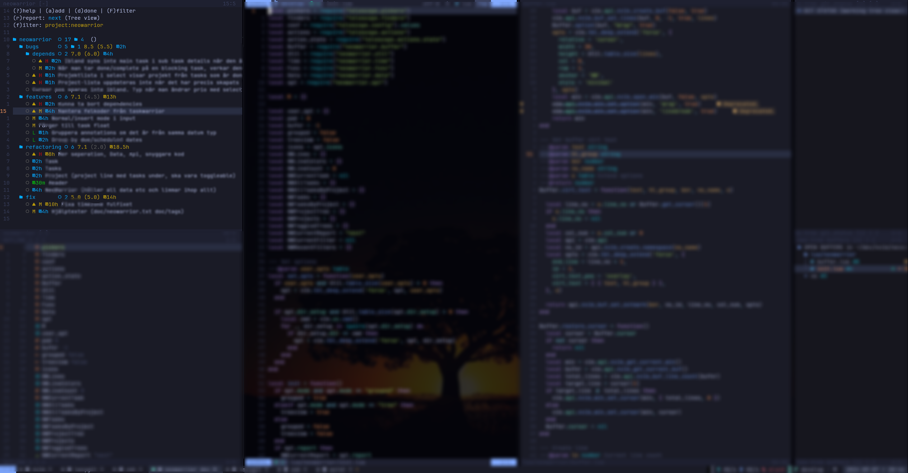

A simple taskwarrior plugin for NeoVim. Made this mostly for my self to have as a sidebar with my tasks inside neovim. 



# Features

- Add, start, modify and mark tasks done
- Filter tasks
  - Select from common filter
  - Custom filter input
- Select report
- Select dependency/parent task
- Show task details
- Task detail float (enabled on active line)
- Grouped and tree views (based on task project)
- Customizable keymaps
- Customizable reports and filters
- Customize config per directory (uses `vim.uv.cwd()`)


# Example config (lazy.nvim)
```lua
{
  'duckdm/neowarrior.nvim',
  event = 'VeryLazy',
  dependencies = { 'nvim-telescope/telescope.nvim' },
  config = function()

    local nw = require('neowarrior')
    local home = vim.env.HOME
    nw.setup({
      report = "next",
      filter = "\\(due.before:2d or due: \\)",
      dir_setup = {
        {
          dir = home .. "/dev/nvim/neowarrior.nvim",
          filter = "project:neowarrior",
          mode = "tree",
          expanded = true,
        },
      }
    })
    vim.keymap.set("n", "<leader>nl", function() nw.open_left() end, { desc = "Open nwarrior on the left side" })
    vim.keymap.set("n", "<leader>nc", function() nw.open_current() end, { desc = "Open nwarrior below current buffer" })
    vim.keymap.set("n", "<leader>nb", function() nw.open_below() end, { desc = "Open nwarrior below current buffer" })
    vim.keymap.set("n", "<leader>na", function() nw.open_above() end, { desc = "Open nwarrior above current buffer" })
    vim.keymap.set("n", "<leader>nr", function() nw.open_right() end, { desc = "Open nwarrior on the right side" })
    vim.keymap.set("n", "<leader>nt", function() nw.focus() end, { desc = "Focus nwarrior" })
  end
}
```

# Default key maps

| Key | Description |
| --- | ----------- |
| ? | Help |
| a | Add task |
| d | Mark task done |
| s | Start task |
| D | Select dependency |
| F | Filter tasks |
| f | Select filter |
| tg | Toggle grouped view |
| tt | Toggle tree view |
| T | Reset tree view |
| r | Select report |
| R | Refresh tasks |
| X | Reset filters |
| W | Collapse all trees |
| E | Expand all trees |
| <Tab> | Toggle tree |
| l | Show task details |
| h | Back |
| q | Close help |
| MM | Modify task |
| Mp | Modify project |
| MP | Modify priority |
| Md | Modify due date |

# Default config values
```lua
{
  -- Show current filter at the top
  show_current_filter = true,
  -- Default filter
  filter = "",
  -- Default report
  report = "next",
  ---@type normal|grouped|tree
  mode = "normal",
  ---@type boolean Whether to expand all trees at start
  expanded = false,
  -- Default project name for tasks without project
  no_project_name = "No project defined",
  -- If task detail float should be enabled (activated on active line)
  float = {
    enabled = true,
    max_width = 60,
  },
  -- Directory specific configs (same format)
  dir_setup = nil,
  -- Reports available in select
  reports = {
    "active", "all", "blocked", "blocking", "completed", "list", "long",
    "ls", "minimal", "newest", "next", "oldest", "overdue", "projects",
    "ready", "recurring", "summary", "tags", "unblocked", "waiting",
  },
  -- Filters available in select
  filters = {
    "due:", "due.not:", "\\(due.before:2d and due.not: \\)",
    "scheduled:", "scheduled.not:", "priority:H",
    "priority.not:H", "priority:M", "priority.not:M", "priority:L",
    "priority.not:L", "priority:", "priority.not:", "project:",
    "project.not:",
  },
  -- Default keys
  keys = {
    help = { key = '?', desc = 'Help' },
    add = { key = 'a', desc = 'Add task' },
    done = { key = 'd', desc = 'Mark task done' },
    start = { key = 's', desc = 'Start task' },
    select_dependency = { key = 'D', desc = 'Select dependency' },
    filter = { key = 'F', desc = 'Filter tasks' },
    select_filter = { key = 'f', desc = 'Select filter' },
    toggle_group_view = { key = 'tg', desc = 'Toggle grouped view' },
    toggle_tree_view = { key = 'tt', desc = 'Toggle tree view' },
    toggle_tree_view_reset = { key = 'T', desc = 'Reset tree view' },
    select_report = { key = 'r', desc = 'Select report' },
    refresh = { key = 'R', desc = 'Refresh tasks' },
    reset = { key = 'X', desc = 'Reset filters' },
    collapse_all = { key = 'W', desc = 'Collapse all trees' },
    expand_all = { key = 'E', desc = 'Expand all trees' },
    toggle_tree = { key = '<Tab>', desc = 'Toggle tree' },
    enter = { key = 'l', desc = 'Show task details' },
    back = { key = 'h', desc = 'Back' },
    close_help = { key = 'q', desc = 'Close help' },
    modify = { key = 'MM', desc = 'Modify task' },
    modify_select_project = { key = 'Mp', desc = 'Modify project' },
    modify_select_priority = { key = 'MP', desc = 'Modify priority' },
    modify_due = { key = 'Md', desc = 'Modify due date' },
  }
}
```
