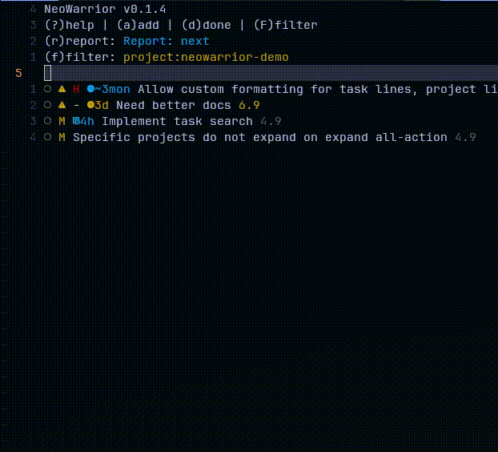

A simple taskwarrior plugin for NeoVim. Made this mostly for my self to have as a sidebar with my tasks inside neovim. 




# Requirements

- [Neovim >=0.10.0](https://github.com/neovim/neovim/releases/tag/v0.10.0)
- [Taskwarrior](https://taskwarrior.org/)

## Optional

- A nerd font is highly recommended for the icons. Se config for setting custom icons.
- [folke/noice.nvim](https://github.com/folke/noice.nvim) for a nice cmdline UI.

# Features

- Add, start, modify and mark tasks done
- Filter tasks
  - Select from common filter
  - Custom filter input
- Select report
- Select dependency/parent task
- Show task details
- Task detail float (enabled on active line)
- Grouped and tree views (based on task project)
- Customizable keymaps
- Customizable reports and filters
- Customize config per directory


# Installation

## Simple setup with lazy.nvim

```lua
return {
  'duckdm/neowarrior.nvim',
  dependencies = {
    'nvim-telescope/telescope.nvim',
    --- Optional but recommended for nicer inputs
    --- 'folke/noice.nvim',
  },
  --- See config example below
  opts = {}
}
```

## Example setup with dir specific configs

```lua
{
  'duckdm/neowarrior.nvim',
  event = 'VeryLazy',
  dependencies = {
    'nvim-telescope/telescope.nvim',
    --- Optional but recommended for nicer inputs
    --- 'folke/noice.nvim',
  },
  config = function()

    local nw = require('neowarrior')
    local home = vim.env.HOME
    nw.setup({
      report = "next",
      filter = "\\(due.before:2d or due: \\)",
      dir_setup = {
        {
          dir = home .. "/dev/nvim/neowarrior.nvim",
          filter = "project:neowarrior",
          mode = "tree",
          expanded = true,
        },
      }
    })
    vim.keymap.set("n", "<leader>nl", function() nw.open_left() end, { desc = "Open nwarrior on the left side" })
    vim.keymap.set("n", "<leader>nc", function() nw.open_current() end, { desc = "Open nwarrior below current buffer" })
    vim.keymap.set("n", "<leader>nb", function() nw.open_below() end, { desc = "Open nwarrior below current buffer" })
    vim.keymap.set("n", "<leader>na", function() nw.open_above() end, { desc = "Open nwarrior above current buffer" })
    vim.keymap.set("n", "<leader>nr", function() nw.open_right() end, { desc = "Open nwarrior on the right side" })
    vim.keymap.set("n", "<leader>nt", function() nw.focus() end, { desc = "Focus nwarrior" })
  end
}
```

# Available commands

| Command | Description |
| ------- | ----------- |
| `:NeoWarriorOpen` | Open NeoWarrior (default to below current buffer) |
| `:NeoWarriorOpen left,right,above,below,current` | Open NeoWarrior on the left, right, above, below current buffer or in current buffer |
| `:NeoWarriorAdd` | Add new task |
| `:NeoWarriorFilter` | Filter |
| `:NeoWarriorFilterSelect` | Select filter |
| `:NeoWarriorReport` | Select report |
| `:NeoWarriorRefresh` | Refresh tasks |

# API methods
```lua
-- Open NeoWarrior
require('neowarrior').open() --- Default, opens below buffer
require('neowarrior').open_left() --- Open on the left side
require('neowarrior').open_right() --- Open on the right side
require('neowarrior').open_above() --- Open above current buffer
require('neowarrior').open_below() --- Open below current buffer
require('neowarrior').open_current() --- Open in current buffer

--- Set filter
require('neowarrior').set_filter("due.before:2d and project:neowarrior")

--- Set report
require('neowarrior').set_report("next")

--- Focus NeoWarrior
require('neowarrior').focus()
```

# Default key maps

| Key | Description |
| --- | ----------- |
| ? | Help |
| q | Close help |
| | |
| a | Add task |
| l | Show task/Activate line action |
| h | Back |
| d | Mark task done |
| s | Start task |
| MM | Modify task |
| Mp | Modify project |
| MP | Modify priority |
| Md | Modify due date |
| D | Select dependency |
| | |
| F | Filter tasks |
| f | Select filter |
| r | Select report |
| X | Reset filters |
| | |
| tg | Toggle grouped view |
| tt | Toggle tree view |
| W | Collapse all trees |
| E | Expand all trees |
| Tab | Toggle tree |
| | |
| R | Refresh tasks |

# Default config values
```lua
{
  ---@type table Task line config
  --- Note: Using more than one of these on the right currently causes some
  --- visual issues, the leftmost value's color will be used for the entire right
  --- "column".
  task_line = {
    ---@type false|"left"|"right" Show warning icon colored based on urgency
    enable_warning_icon = "left",
    ---@type false|"eol"|"right" Show urgency
    enable_urgency = "eol",
    ---@type false|"left" Show task-has-recurrance indicator
    enable_recur_icon = "left",
    ---@type false|"left" Show priority (H, M, L)
    enable_priority = "left",
    ---@type false|"left" Show due date
    enable_due_date = "left",
    ---@type false|"left" Show estimate. Note: This is not a default
    ---field in taskwarrior
    enable_estimate = "left",
  },

  ---@type table Project line config.
  ---
  --- Note: These values are not always shown (on the task detail page for
  --- instance). Set values to either false, "eol" or "right" to enable
  --- or show them at specific positions.
  ---
  --- Note: Using more than one of these on the right currently causes some
  --- visual issues, the leftmost value's color will be used for the entire right
  --- "column".
  project_line = {
    ---@type false|"eol"|"right" Show task count
    enable_task_count = "eol",
    ---@type false|"eol"|"right" Show average urgency
    enable_average_urgency = "eol",
    ---@type false|"eol"|"right" Show total urgency
    enable_total_urgency = false,
    ---@type false|"eol"|"right" Show total estimate (Note: This is not a
    ---default field in taskwarrior)
    enable_total_estimate = "eol",
  },

  ---@type table Header config
  header = {
    ---@type string|nil Custom header text (disable with nil)
    text = "NeoWarrior {version}",
    ---@type boolean Whether to show help line
    enable_help_line = true,
    ---@type boolean Whether to show the current report at the top
    enable_current_report = true,
    ---@type boolean Whether to show the current view on the report line
    enable_current_view = true,
    ---@type boolean Whether to show the current filter at the top
    enable_current_filter = true,
  },

  ---@type string Default taskwarrior filter
  filter = "",

  ---@type string Default taskwarrior report
  report = "next",

  ---@type "normal"|"grouped"|"tree" Default view mode
  mode = "normal",

  ---@type boolean Whether to expand all trees at start
  expanded = false,

  ---@type string Default project name for tasks without project
  no_project_name = "no-project",

  ---@type table Task float
  float = {
    ---@type boolean Enable floating window for tasks
    enabled = true,
    ---@type number Max width of float in columns
    max_width = 60,
    ---@type number Time in milliseconds before detail float is shown
    delay = 200,
  },

  ---@type number Timezone offset in hours
  time_offset = 0,

  ---@type table Colors and hl groups.
  ---
  ---You can use custom hl groups or just define colors for the existing
  ---highlight groups. A nil/false value for a color means it's
  ---disabled/transparent.
  colors = {
    dim = { group = "NeoWarriorTextDim", fg = "#333333", bg = nil },
    danger = { group = "NeoWarriorTextDanger", fg = "#cc0000", bg = nil },
    warning = { group = "NeoWarriorTextWarning", fg = "#ccaa00", bg = nil },
    success = { group = "NeoWarriorTextSuccess", fg = "#00cc00", bg = nil },
    info = { group = "NeoWarriorTextInfo", fg = "#00aaff", bg = nil },
    danger_bg = { group = "NeoWarriorTextDangerBg", fg = "#ffffff", bg = "#cc0000" },
    project = { group = "NeoWarriorGroup", fg = "#00aaff", bg = nil },
  },
  --- Example using builtin highlight groups:
  -- colors = {
  --   dim = { group = "Whitespace" },
  --   danger = { group = "ErrorMsg" },
  --   warning = { group = "WarningMsg" },
  --   success = { group = "FloatTitle" },
  --   info = { group = "Question" },
  --   danger_bg = { group = "ErrorMsg" },
  --   project = { group = "Directory" },
  -- },

  ---@type table|nil Set config values for specific directories. Most
  --- config values from this file should work per dir basis too.
  dir_setup = nil,

  ---@type table Default reports available (valid taskwarrior reports). Used
  ---in selects.
  reports = {
    "active", "all", "blocked", "blocking", "completed", "list", "long",
    "ls", "minimal", "newest", "next", "oldest", "overdue", "projects",
    "ready", "recurring", "summary", "tags", "unblocked", "waiting",
  },

  ---@type table Default filters available (valid taskwarrior filters). Used
  ---in selects.
  filters = {
    "due:", "due.not:", "\\(due.before:2d and due.not: \\)",
    "scheduled:", "scheduled.not:", "priority:H",
    "priority.not:H", "priority:M", "priority.not:M", "priority:L",
    "priority.not:L", "priority:", "priority.not:", "project:",
    "project.not:",
  },

  ---@type table Default key mappings. Disable all by setting keys to nil or false.
  keys = {
    help = '?', --- Show help
    add = 'a', --- Add task
    done = 'd', --- Mark task as done
    start = 's', --- Start task
    select_dependency = 'D', --- Select dependency
    filter = 'F', --- Input filter
    select_filter = 'f', --- Select filter
    toggle_group_view = 'tg', --- Toggle grouped view
    toggle_tree_view = 'tt', --- Toggle tree view
    select_report = 'r', --- Select report
    refresh = 'R', --- Refresh tasks
    reset = 'X', --- Reset filter
    collapse_all = 'W', --- Collapse all tree nodes
    expand_all = 'E', --- Expand all tree nodes
    toggle_tree = '<Tab>', --- Toggle tree node
    enter = 'l', --- Enter task/Activate line action
    back = 'h', --- Go back
    close_help = 'q', --- Close help
    modify = 'MM', --- Modify task
    modify_select_project = 'Mp', --- Modify project
    modify_select_priority = 'MP', --- Modify priority
    modify_due = 'Md', --- Modify due date
  },

  ---@type table Default icons
  icons = {
    tree_line = "│", --- NOTE: Not currently used
    tree_item = "├", --- NOTE: Not currently used
    tree_item_last = "└", --- NOTE: Not currently used
    task = "\u{f1db}",
    task_completed = "\u{f14a}",
    recur = "\u{f021}",
    project = "\u{f07b}",
    project_alt = "\u{f0256}",
    project_open = "\u{f115}",
    warning = "\u{f071}",
    annotated = "\u{f1781}",
    start = "\u{f040a}",
    due = "\u{f1442}",
    est = "\u{f0520}",
    deleted = "\u{f014}",
    depends = "\u{f111}",
  },
}
```
